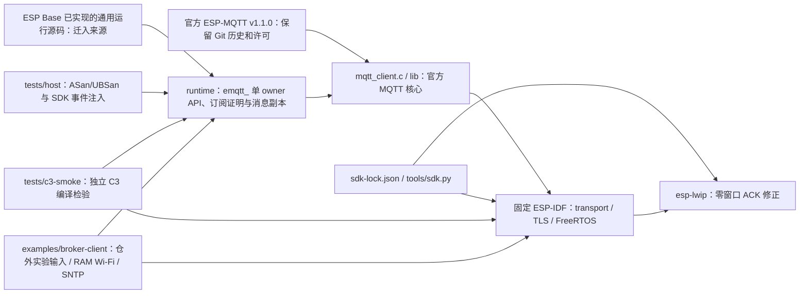

# ESP MQTT

`esp-mqtt` 是从官方 ESP-MQTT v1.1.0 固定提交 `1a1e5788a5cf57a0f44a3c6c061407f6c9be1026` 派生的独立 ESP-IDF `mqtt` 组件。官方 MQTT 编解码、QoS、重传和 outbox 保持原有源码与历史；本仓新增通用 `emqtt_` 运行接口，负责有界配置、订阅就绪、事件副本、分片重组与生命周期。上游许可为 Apache-2.0，来源和逐层差异见[来源归属与差异盘点](docs/design/source-provenance.md)。当前仅建立本地未提交基线，尚无 `darren-you/esp-mqtt` 远端、发布提交、Base 消费切换或独立实板验收。

## 架构拓扑



组件名保持官方 `mqtt`，公开官方 `mqtt_client.h` 与 `esp_mqtt_client_*` 符号；新增通用接口在 `runtime/include/emqtt.h` 与 `emqtt_contract.h`。本仓不生成持久设备身份、不写 NVS、不拥有 Base 的业务 Topic、命令 ACK 或配置事务。`emqtt_config_t.client_id` 由调用方提供，最长 128 字节；Base 后续继续从自己的持久 UUID 装配它。

## 独立开发

从本仓根运行，无需工作区或相邻 checkout：

```bash
bash tests/host/run.sh
python3 -m unittest discover -s tools/tests -p 'test_*.py'
```

host 测试需要 C11 编译器，启用 ASan/UBSan；运行层测试直接包含本仓官方 `mqtt_client.h`，使用 fake 注入 SDK 事件和 API 结果。它验证参数、队列、订阅/退订、重组、错误映射和释放，不实现 Broker、MQTT 核心、真实并发或 ESP 资源。官方自带 `test/host` 依赖 ESP-IDF 和上游测试工具，尚未纳入本轮独立回归。

ESP32-C3 构建须用 `sdk-lock.json` 的 ESP-IDF `fff9895c82d744c7237be8847347bdd1b07c6643` 和 `esp-lwip` `2758df4cd3666b3b2a5b53830148379326425c0d`；[SDK 准备与检查](tools/README.md)只操作显式独立 checkout。组件 CMake 拒绝原始 lwIP、额外 SDK 修改或外部 lwIP 组件覆盖。调用方最终配置须启用 `CONFIG_MQTT_REPORT_DELETED_MESSAGES=y` 与 `CONFIG_MBEDTLS_HAVE_TIME_DATE=y`，且 MQTT 事件队列保持单项同步分发，确保官方 DATA 借用指针在回调内复制；普通固件禁止 `CONFIG_EMQTT_PLAINTEXT_LAB`，生产连接需要 CA、主机名和调用方建立的可信时间。[C3 编译检验](tests/c3-smoke/README.md)已在固定 SDK 下成功生成镜像，只核对组件/接口编译和链接。[独立 Broker 样例](examples/broker-client/README.md)提供 RAM Wi-Fi、SNTP、严格 TLS、固定测试 Topic 与生命周期命令；真实 Broker/C3 矩阵仍待执行。

`idf_component.yml` 的 `0.1.0` 是本地第一方组件版本，区别于官方上游 v1.1.0，尚未发布。未来消费者须从公开维护仓固定完整提交，不能读取本工作区 checkout、`harness/external` 或 Base 的 `managed_components`；Base 的旧实现和官方 Registry 依赖要在 P3c 同批硬切后移除。本地新仓未登记工作区 gitlink，待维护仓首个提交与远端建立后再纳管。

- [运行层与测试](tests/README.md)
- [来源归属与差异盘点](docs/design/source-provenance.md)
- [P3-04 本机回归记录](docs/verification/p3-host-regression.md)
- [ESP Base、FRP、MQTT、OTA 与 Container 五仓开发计划](https://github.com/darren-you/darren-space/blob/master/harness/docs/design/darren-space/global/esp-base-frp-mqtt-ota-container-development-plan.md)
