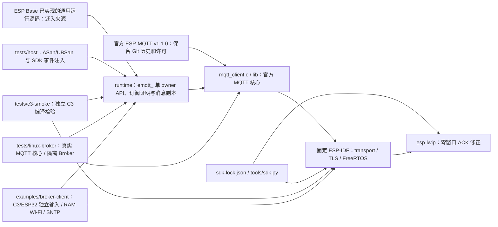

# ESP MQTT

组件清单现排除 Git 子模块的 `.git` 定位文件，防止缓存路径改变同一源码 SHA 的制品摘要。官方 Component Manager 的正负控制与跨缓存验证见[组件摘要检查点](docs/verification/component-hash-reproducibility.md)；运行源码与既有 C3 实板证据保持其原始版本边界。

`esp-mqtt` 是从官方 ESP-MQTT v1.1.0 固定提交 `1a1e5788a5cf57a0f44a3c6c061407f6c9be1026` 派生的独立 ESP-IDF `mqtt` 组件。官方 MQTT 编解码与 QoS 主体保留上游源码与历史；本仓在断线时精确清理 clean session 未确认的订阅控制报文，并保留 QoS 发布重试。新增通用 `emqtt_` 运行接口负责有界配置、订阅就绪、事件副本、分片重组与生命周期；入站片通常直接写入预留消息槽，三槽占满时为第四条在途消息临时分配一个消息缓冲，[C3 字节账本与验证](docs/verification/c3-low-memory.md)记录常驻申请与动态峰值。上游许可为 Apache-2.0，来源和逐层差异见[来源归属与差异盘点](docs/design/source-provenance.md)。Base 已删除原通用运行层，并在普通固件接入 MQTT owner 与设备命令；C3 已在同一独立实验镜像上完成 30 个网络场景组与 100 次实例销毁重建；Base 的真实业务 ACK、ESP32 同候选矩阵、原生业务组合与正式交付仍待完成。

## 架构拓扑


```mermaid
flowchart LR
    upstream["官方 ESP-MQTT v1.1.0：保留 Git 历史和许可"] --> core["mqtt_client.c / lib：官方 MQTT 核心"]
    base["ESP Base 已实现的通用运行源码：迁入来源"] --> runtime["runtime：emqtt_ 单 owner API、订阅证明与消息副本"]
    runtime --> core
    core --> idf["固定 ESP-IDF：transport / TLS / FreeRTOS"]
    sdk["sdk-lock.json / tools/sdk.py"] --> idf
    sdk --> lwip["esp-lwip：零窗口 ACK 修正"]
    idf --> lwip
    host["tests/host：ASan/UBSan 与 SDK 事件注入"] --> runtime
    smoke["tests/c3-smoke：独立 C3 编译检验"] --> runtime
    smoke --> idf
    linux["tests/linux-broker：真实 MQTT 核心 / 隔离 Broker"] --> runtime
    linux --> core
    broker["examples/broker-client：C3/ESP32 独立输入 / RAM Wi-Fi / SNTP"] --> runtime
    broker --> idf
```

组件名保持官方 `mqtt`，公开官方 `mqtt_client.h` 与 `esp_mqtt_client_*` 符号；新增通用接口在 `runtime/include/emqtt.h` 与 `emqtt_contract.h`。本仓不生成持久设备身份、不写 NVS、不拥有 Base 的业务 Topic、命令 ACK 或配置事务。`emqtt_config_t.client_id` 由调用方提供，最长 128 字节；Base 后续继续从自己的持久 UUID 装配它。

## 独立开发

从本仓根运行，无需工作区或相邻 checkout：

```bash
bash tests/host/run.sh
python3 -m unittest discover -s tools/tests -p 'test_*.py'
```

host 测试需要 C11 编译器，启用 ASan/UBSan；运行层测试直接包含本仓官方 `mqtt_client.h`，使用 fake 注入 SDK 事件和 API 结果。它验证参数、队列、订阅/退订、重组、错误映射和释放。另有 `tests/linux-broker` 使用固定 SDK 编译真实 MQTT 核心与运行层，连接本机隔离 Broker 验证断线后的控制报文和 QoS1 重传；这不代表 C3 实板或 TLS 验收。官方自带 `test/host` 依赖 ESP-IDF 和上游测试工具，尚未纳入本轮独立回归。

ESP32-C3 与 ESP32-D0WD-V3 分别以 IDF target `esp32c3`、`esp32` 构建，均须用 `sdk-lock.json` 的公开 ESP-IDF fork `578cf89c343e388db43ba1f4ddcd602fedcb763c` 和 `esp-lwip` `2758df4cd3666b3b2a5b53830148379326425c0d`；fork 从官方 `fff9895c82d744c7237be8847347bdd1b07c6643` 派生，依次修复 `esp_ota_begin` 擦除失败后的句柄泄漏和 HTTP 客户端初始化失败时的传输句柄泄漏。[SDK 准备与检查](tools/README.md)只操作显式独立 checkout。正式 SDK 同时采用组件锁定的 ESP Base 容量统计派生：本组件只保存唯一 recipe 的公开来源、精确提交与摘要，不复制修改清单。SDK 根 `esp-sdk-derivation.json` 须与冻结 recipe 逐字相同；组件 CMake 的本仓 reader 先核完整清单，再核 IDF／lwIP／TLSF 的真实提交、原文与派生字节、索引和全部子模块，不接受旧 SDK、部分或额外修改、清单漂移或外部 lwIP 组件覆盖。检查不下载、不执行 SDK 脚本，也不依赖相邻 Base checkout；SDK 输入通过与业务组合容量、实板和正式发行分别验收。调用方最终配置须启用 `CONFIG_MQTT_REPORT_DELETED_MESSAGES=y` 与 `CONFIG_MBEDTLS_HAVE_TIME_DATE=y`，且 MQTT 事件队列保持单项同步分发，确保官方 DATA 借用指针在回调内复制；普通固件禁止 `CONFIG_EMQTT_PLAINTEXT_LAB`，生产连接需要 CA、主机名和调用方建立的可信时间。[C3 编译检验](tests/c3-smoke/README.md)的历史候选已在固定 SDK 下成功生成镜像，只核对组件/接口编译和链接。[独立 Broker 样例](examples/broker-client/README.md)提供双目标隔离构建、RAM Wi-Fi、SNTP、严格 TLS、固定测试 Topic 与生命周期命令；本轮双目标构建证据见 [P3 Broker 软件准备记录](docs/verification/p3-broker-preparation.md)，两台实板 Broker 矩阵仍待验证。

`idf_component.yml` 的 `0.1.0` 是第一方组件版本，区别于官方上游 v1.1.0；当前公开源码不等于已完成组件发行或设备验收。消费者须从公开维护仓固定完整提交，不能读取本工作区 checkout、`harness/external` 或 Base 的 `managed_components`。`esp-base@a0eabdf` 已删除旧 `mqtt_runtime` 与 Registry 重复依赖，隔离实验应用直接消费本仓；`esp-base@ecf1539` 后普通固件已接入 MQTT owner 与设备命令，真实 Broker/设备 ACK 和迁移仍待验收。工作区已登记本仓 gitlink，后续版本升级须与真实消费提交一致。

公开入站上限保持 4096 字节；出站上限为 5120 字节，使调用方能够发布含完整版本正文和状态元数据的有界文档。出站仍由官方 outbox 复制与限额管理，不扩大入站消息或事件队列；最大出站报文增加的堆峰值需要实板单独测量。host 边界回归和 Linux QoS1 场景覆盖该上限、逐字节 Broker 核对与丢 ACK 后的原 ID／DUP 重传。

入站消息仍最多有三条完整消息等待 owner 取走；消息体从首片到达时按声明的总载荷长度分配，`poll` 复制交付或停止／错误清退时擦除并释放。第四条分片可临时持有缓冲，若完成时仍没有空槽则关闭会话。私有 owner 保留 272 字节元数据及实际载荷，公开值拷贝接口与 4096 字节上限保持；C3／ESP32 的满长申请仍为 4368 字节。零／小消息不再申请未使用的最大载荷空间，畸形续片不能改变释放长度；未用的公开消息尾部保持为零。软件与真实核心验证见[实际长度消息所有权检查点](docs/verification/mqtt-sized-message-owner-checkpoint.md)。满队列峰值和正式 Base 原生业务组合仍需单独测量。

运行对象仅保留运行期间实际需要的 TLS 策略、期望订阅和按实际长度申请的 CA。官方核心在创建时复制地址、身份、凭据及遗嘱，CA 则借用到 client 销毁；运行层在 SDK 销毁成功后清零释放证书。公开 config、八个订阅和消息／outbox 限额保持原值。官方 C3 编译器确认运行对象由 8056 降到 2416 字节，另加实际 CA；软件、双目标编译与实板容量的范围分别见[常驻配置所有权检查点](docs/verification/mqtt-owned-config-checkpoint.md)。

- [运行层与测试](tests/README.md)
- [入站消息体存活期与资源边界](docs/verification/mqtt-inbound-message-lifetime.md)
- [来源归属与差异盘点](docs/design/source-provenance.md)
- [P3-04 本机回归记录](docs/verification/p3-host-regression.md)
- [C3 Broker 实板检查点](docs/verification/c3-broker-physical-checkpoint.md)
- [C3 MQTT 实板网络矩阵](docs/verification/c3-mqtt-network-matrix.md)
- [订阅控制报文断线回归](docs/verification/mqtt-control-reconnect-linux.md)
- [QoS1 ACK 与重投回归](docs/verification/mqtt-qos1-ack-linux.md)
- [真实核心生命周期与 transport OOM 回归](docs/verification/mqtt-lifecycle-transport-oom.md)
- [真实核心 Linux TLS 与证书拒绝回归](docs/verification/mqtt-tls-linux.md)
- [真实核心百次 Broker 生命周期回归](docs/verification/mqtt-linux-broker-lifecycle-100.md)
- [ESP 原生业务、FRP OTA 与双目标验证](https://github.com/darren-you/esp-base/blob/master/docs/operations/ota-allocation-diagnostic-checkpoint.md)
