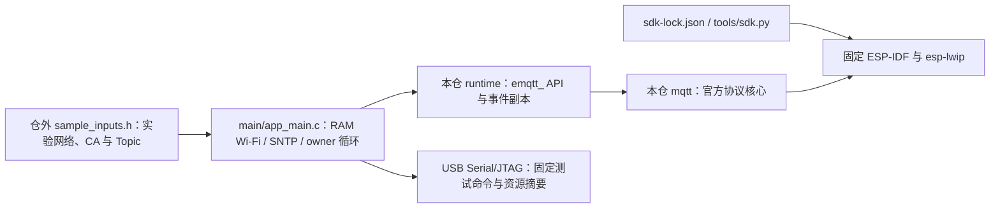

# ESP MQTT 独立 Broker 样例

此 ESP32-C3 工程只使用本仓 `mqtt` 组件与锁定的公开 ESP-IDF/lwIP。它从仓外头文件取得实验 Wi-Fi、Broker、CA、ClientID 与 Topic，使用 RAM Wi-Fi 和 SNTP；未取得可信时间前不启动严格 TLS 客户端。样例不初始化或擦除 NVS，不读取 Base 身份与配置，不执行任何设备物理输出。

## 架构拓扑



复制 `inputs.example.h` 到仓外受控路径，填入隔离实验环境的 SSID、密码、NTP 主机、Broker DNS 主机、端口、PEM CA、固定 ClientID、可选用户名密码，以及订阅、动态订阅、发布和 LWT Topic。不要填生产凭据或设备持久 UUID。空示例可以编译，但启动后在接入网络前明确拒绝。当前只接受 WPA2 PSK 和 TLS Broker；构建配置拒绝明文实验开关及 PHY 校准 NVS 存储。

准备[锁定 SDK](../../tools/README.md)并导出 `IDF_PATH` 后，从仓根构建到独立输出目录：

```bash
EMQTT_SAMPLE_INPUTS=/private/lab/sample_inputs.h \
  bash examples/broker-client/build.sh /private/build/esp-mqtt-broker
```

不设置 `EMQTT_SAMPLE_INPUTS` 时使用空示例。`build.sh` 要求输出目录仅当前用户可访问，因为构建时会复制输入头文件；它在输出目录创建名为 `mqtt` 的临时源码入口，以满足 IDF 组件名，不复制或修改组件源码。构建不会刷板。真实设备写入须先独立核对精确板卡、分区、设备身份、两份一致的完整 Flash 恢复基线与本轮授权；此样例的构建成功不构成联网实板验收。

实验串口命令均使用输入文件中的固定 Topic，不接受从串口注入任意目标：`stats`、`publish`、`subscribe`、`unsubscribe`、`stop`、`start`、`cycle`、`wifi_down`、`wifi_up`。`EMQTT_SAMPLE_EVENT` 只打印事件种类、错误、消息 ID、Topic 和长度，不打印载荷、CA 或密码；`EMQTT_SAMPLE` 打印 outbox 与 heap 观测值。READY 只在本次 SUBACK 逐项通过后出现。输出用于定位独立 Broker 矩阵，不代替 Broker 侧记录、100 次回收和 Base 组合验证。
