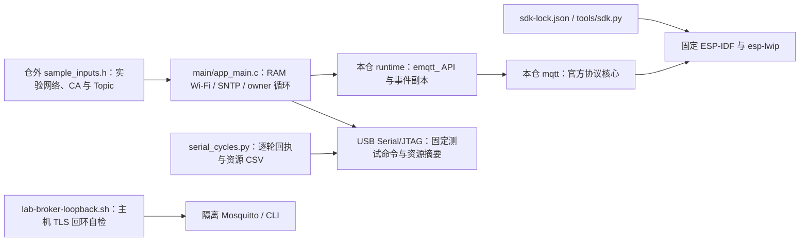

# ESP MQTT 独立 Broker 样例

此 ESP32-C3 工程只使用本仓 `mqtt` 组件与锁定的公开 ESP-IDF/lwIP。它从仓外头文件取得实验 Wi-Fi、Broker、CA、ClientID 与 Topic，使用 RAM Wi-Fi 和 SNTP；未取得可信时间前不启动严格 TLS 客户端。样例不初始化或擦除 NVS，不读取 Base 身份与配置，不执行任何设备物理输出。

## 架构拓扑



复制 `inputs.example.h` 到仓外受控路径，填入隔离实验环境的 SSID、密码、NTP 主机、Broker DNS 主机、端口、PEM CA、固定 ClientID、可选用户名密码，以及订阅、动态订阅、发布和 LWT Topic。不要填生产凭据或设备持久 UUID。空示例可以编译，但启动后在接入网络前明确拒绝。当前只接受 WPA2 PSK 和 TLS Broker；构建配置拒绝明文实验开关及 PHY 校准 NVS 存储。

准备[锁定 SDK](../../tools/README.md)并导出 `IDF_PATH` 后，从仓根构建到独立输出目录：

```bash
EMQTT_SAMPLE_INPUTS=/private/lab/sample_inputs.h \
  bash examples/broker-client/build.sh /private/build/esp-mqtt-broker
```

不设置 `EMQTT_SAMPLE_INPUTS` 时使用空示例。`build.sh` 要求输出目录仅当前用户可访问，因为构建时会复制输入头文件；它在输出目录创建名为 `mqtt` 的临时源码入口，以满足 IDF 组件名，不复制或修改组件源码。构建不会刷板。真实设备写入须先独立核对精确板卡、分区、设备身份、两份一致的完整 Flash 恢复基线与本轮授权；此样例的构建成功不构成联网实板验收。

## 本机 Broker 回环

本机已有 Mosquitto、`mosquitto_pub`、`mosquitto_sub`、OpenSSL 和 Python 时，从仓根执行：

```bash
bash examples/broker-client/lab-broker-loopback.sh
```

脚本在仅当前用户可读的临时目录生成一次性 CA/服务端证书，Broker 只监听 `127.0.0.1` 随机端口，验证严格 TLS、QoS0/1、retained 和 4096/4097 字节传输，退出即清理。这只证明主机实验 Broker 及 CLI 路径可用；回环地址不能供 C3 使用，也不执行本仓 MQTT 客户端。

串口驱动的回执顺序、在线入队失败与缺失 PUBACK 拒绝可在无设备的主机上回归：

```bash
python3 -m unittest discover -s examples/broker-client -p 'test_serial_cycles.py'
```

## 实板诊断与矩阵入口

实验串口命令只使用仓外输入头文件的固定 Topic，不接受串口传入目标或载荷：

| 命令 | 行为与应查证据 |
| --- | --- |
| `stats` | 当前 state、Wi-Fi、可信时间、outbox、空闲/最低/最大连续 heap |
| `publish0` / `publish` | 向固定发布 Topic 排入 `ping`，分别用 QoS0/1；QoS0 不等待 PUBACK，Broker 侧核对实际交付 |
| `publish4k` | 向固定发布 Topic 排入 4096 个 `A`，QoS1；Broker 侧核对原始字节与 `fea63440` CRC32 |
| `subscribe` / `unsubscribe` | 动态新增/删除固定 filter；核对 READY/UNSUBACK、Broker 订阅与其后是否收消息 |
| `wifi_down` / `wifi_up` | 停止/启动 RAM Wi-Fi；核对 DISCONNECTED、重连后的本次 SUBACK→READY 与 outbox 结果 |
| `fill` | 只在 DISCONNECTED 状态向固定发布 Topic 最多排入 8 条 4096 字节 QoS1 消息；记录接受数、`0x7501` 满错误与 outbox 大小 |
| `stop` / `start` / `cycle` | 关闭、启动或销毁重建实例；`cycle` 每次立即打印资源快照 |

事件种类对应 `runtime/include/emqtt.h`：`0=CONNECTED`、`1=READY`、`2=DISCONNECTED`、`3=MESSAGE`、`4=PUBACK`、`5=DELETED`、`6=UNSUBSCRIBED`、`7=ERROR`。`EMQTT_SAMPLE_EVENT` 打印错误、消息 ID、Broker 返回码、TLS 标志、Topic、长度、QoS、retain、duplicate 与收到的载荷 CRC32，不打印载荷或秘密；非 MESSAGE 事件的消息字段为零。`EMQTT_SAMPLE` 打印资源值。CRC32 用于实验载荷比对，不充当安全摘要。`READY` 只在本次 SUBACK 逐项通过后出现。`start` 在 Wi-Fi 与可信时间未就绪时返回错误；连接成功或命令返回零不等于 Broker 完成相应操作。

获准写入并启动真实 C3 后，隔离 Broker 必须在实验 Wi-Fi 可达的私有地址监听 TLS，输入的 DNS 主机名须与服务端证书 SAN 匹配；从 Broker 侧留存 CONNECT/SUBSCRIBE/PUBLISH/PUBACK/断开记录。不要把本机回环脚本的 `127.0.0.1`、一次性 CA 或匿名配置当作设备/生产 Broker。先记录本仓完整提交、镜像 SHA-256、固定 IDF/lwIP SHA、构建配置、板卡与串口，再按以下顺序执行，同一候选才可组成 P3-07 证据：

1. 等待 Wi-Fi、SNTP、严格 TLS、CONNECTED、初始 SUBACK 和 READY。用 `publish0`、`publish`、`publish4k` 比对 Broker 侧 QoS、消息 ID、PUBACK 与 4096 字节内容；用隔离发布端向初始订阅 Topic 分别发送 QoS0/1、4096 与 4097 字节。4096 字节 `A` 的接收 CRC32 应为 `fea63440`；4097 字节必须报告分片/容量错误，不能成为完整 MESSAGE。
2. 对动态 Topic 执行 `subscribe`，核对该新增订阅的 READY 与 Broker SUBACK，再由发布端投递；执行 `unsubscribe`，核对 UNSUBACK，随后确认该 filter 不再交付。用 Broker ACL 拒绝订阅，核对 ERROR/失败状态；分别用隔离的错误账号和错误 CA 构建输入验证认证与证书拒绝。
3. 核对在线 retained、异常断开后的 LWT、Broker 重启与 Wi-Fi 恢复。先等待 `wifi_down` 后的 DISCONNECTED，再执行 `fill`；记录 outbox 满、超过配置过期时间后的 DELETED，以及恢复后的重复/未确认 QoS1 行为。选择能精确控制 PUBACK 丢失或重放的隔离 Broker 故障注入器并保存报文证据；普通 Mosquitto 回环脚本不会制造丢 ACK 或 MQTT DUP 位，重复发送同一载荷也不能冒充该用例。
4. 在网络与 Broker 稳定且已 READY 时执行 100 次 `cycle`，每轮等待新 READY、在线状态 PUBACK 与空 outbox，再比较同状态下的空闲 heap、最大连续块与 Broker 连接数。`heap_min` 是启动后的历史最低值，不可当作逐轮当前占用。可用锁定 IDF 导出的 Python 与已核对的串口运行下列只发送固定 `stats`/`cycle` 命令的驱动；CSV 留在仓外受控路径。串口驱动只验证逐轮回执并收集趋势，不自动判定无泄漏。

```bash
python3 examples/broker-client/serial_cycles.py \
  --port /dev/cu.<本轮已核对串口> --count 100 \
  > /private/lab/esp-mqtt-cycles.csv
```

错误认证、证书、订阅拒绝、4 KiB 超限和丢 ACK 分别需要相应实验 Broker/输入配置；不能用单次正常会话推断这些负例。真实设备写入仍须先满足上文的精确板卡、分区与两份一致完整 Flash 恢复基线，并取得本轮授权。当前这些实板步骤均未执行，不能把本机脚本或固定 SDK 编译记为 P3-06/P3-07 验收。
