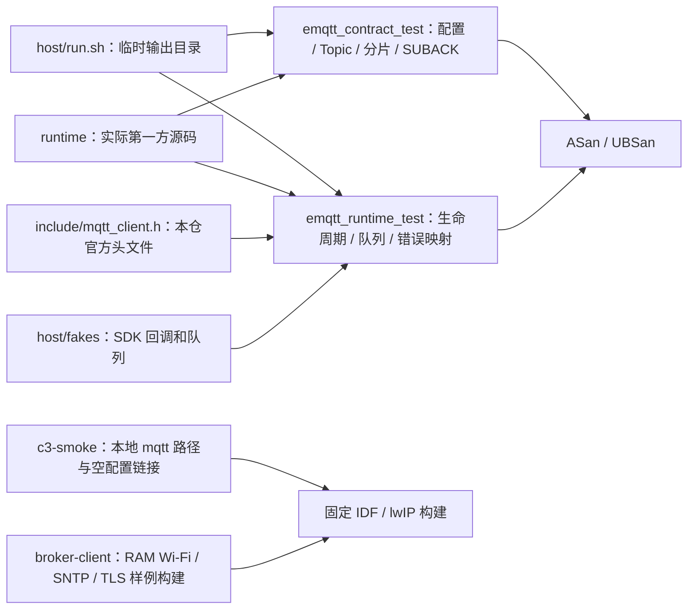

# ESP MQTT 测试

`host/run.sh` 以 C11、ASan、UBSan 编译本仓的通用运行源码和锁定上游头文件。fake 只注入 SDK API 返回、事件与队列，不实现官方 MQTT 编解码、Broker、TLS、FreeRTOS 并发或真实网络。上游原 `test/host` 保留为来源内容，当前未纳入本轮独立门禁。

## 架构拓扑

在独立 checkout 根运行 `bash tests/host/run.sh`；脚本创建并清理临时构建目录，不读取 Base、工作区根、环境中的 Broker 凭据或真实硬件。测试覆盖非 UUID ClientID、配置复制、TLS 时间前置、动态订阅与精确回执、4 KiB 重组、失败释放和 100 次生命周期；通过不等于 P3b 实板/Broker 验收。

`c3-smoke` 在固定 SDK 下编译并链接官方核心与新运行接口，已生成 C3 镜像；它不连接网络、不读写设备，详见[C3 编译检验](c3-smoke/README.md)。

当前运行层的命令、固定 SDK/源码候选摘要和结果见[P3-04 本机回归记录](../docs/verification/p3-host-regression.md)。

[Broker 样例](../examples/broker-client/README.md)用于后续独立 C3 网络矩阵。构建仅证明装配和可执行路径存在；真实 TLS、Broker、资源回收与硬件结果必须单独记录。
