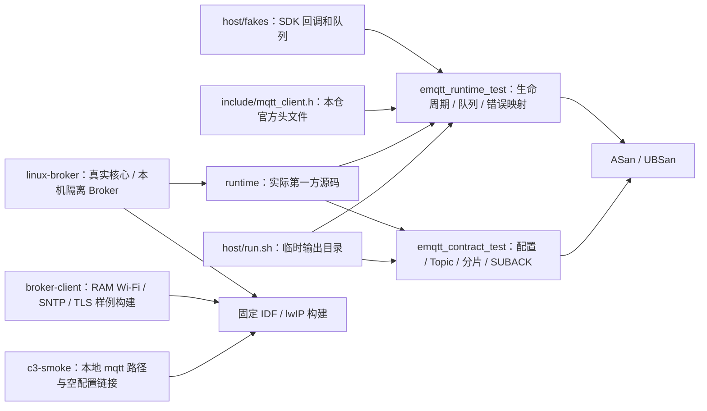

# ESP MQTT 测试

`host/run.sh` 以 C11、ASan、UBSan 编译本仓的通用运行源码和锁定上游头文件。fake 只注入 SDK API 返回、事件与队列，不实现官方 MQTT 编解码、Broker、TLS、FreeRTOS 并发或真实网络。动态订阅与退订的回执测试还核对：拒绝、超时、断线及错误 ID 后，重连只提交原期望列表；成功回执后才提交变更。上游原 `test/host` 保留为来源内容，当前未纳入本轮独立门禁。

`test/mqtt_outbox_host_test` 则在 IDF Linux host target 直接编译本仓真实 `lib/mqtt_outbox.c`。新增定向用例核对 clean session 断线需删除的已排队/已发送 SUBSCRIBE、UNSUBSCRIBE，及应保留的 QoS1 PUBLISH、PUBREL；该测试不能证明实际断线入口已调用清理函数，也不能证明 Broker 订阅集。

## 架构拓扑



在独立 checkout 根运行 `bash tests/host/run.sh`；脚本创建并清理临时构建目录，不读取 Base、工作区根、环境中的 Broker 凭据或真实硬件。测试覆盖非 UUID ClientID、配置复制、TLS 时间前置、动态订阅与精确回执、4 KiB 重组、失败释放和 100 次生命周期；通过不等于 P3b 实板/Broker 验收。

`c3-smoke` 在固定 SDK 下编译并链接官方核心与新运行接口，已生成 C3 镜像；它不连接网络、不读写设备，详见[C3 编译检验](c3-smoke/README.md)。

`linux-broker` 在固定 SDK 的 IDF Linux 目标编译真实 `mqtt_client.c`、outbox 和 `emqtt.c`，以 `127.0.0.1` 临时端口的隔离 MQTT 3.1.1 Broker 扣留 SUBACK / UNSUBACK 约 9 秒后断线重连。先导出 `sdk-lock.json` 指向的 ESP-IDF 环境，然后从本仓根运行：

```bash
bash tests/linux-broker/run.sh "$PWD" /tmp/esp-mqtt-linux-broker-full full
bash tests/linux-broker/run.sh "$PWD" /tmp/esp-mqtt-linux-broker-unsub unsub-only
bash tests/linux-broker/run.sh "$PWD" /tmp/esp-mqtt-linux-broker-qos1 qos1-ack
```

输出目录放在仓外，每个场景使用独立目录。脚本通过组件 CMake 执行固定 SDK/lwIP 检查；`full` 与 `unsub-only` 核对新 clean session 的 Broker 订阅集、旧 SUB/UNSUB 不重放，以及混合 QoS1 PUBLISH 的 `DUP=1` 重发与 PUBACK。`qos1-ack` 独立核对同一连接丢 PUBACK 后按原 ID、原载荷和 `DUP=1` 重发，重复 PUBACK 只产生一次完成事件；还核对入站 QoS1 重投两次交付、两次回 PUBACK、断线后重发以及最终 outbox 清空。本机 Linux Broker 回归不代表 ESP32-C3 实板、TLS 或生产网络验收。

新版通过和旧版复现的精确对照见[订阅控制报文断线回归](../docs/verification/mqtt-control-reconnect-linux.md)。
[QoS1 ACK 与重投回归](../docs/verification/mqtt-qos1-ack-linux.md)记录独立真实核心场景及事件语义。

当前运行层的命令、固定 SDK/源码候选摘要和结果见[P3-04 本机回归记录](../docs/verification/p3-host-regression.md)。

[Broker 样例](../examples/broker-client/README.md)用于后续独立 C3 网络矩阵。构建仅证明装配和可执行路径存在；真实 TLS、Broker、资源回收与硬件结果必须单独记录。
