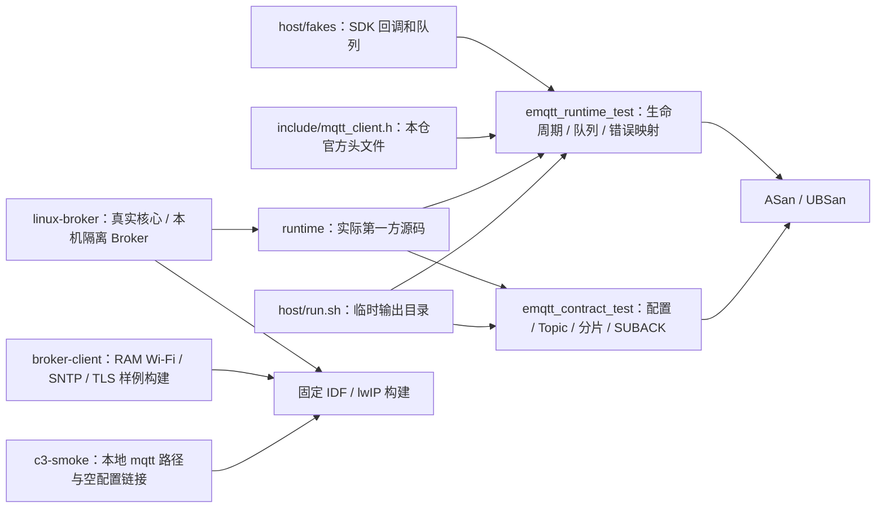

# ESP MQTT 测试

`host/run.sh` 以 C11、ASan、UBSan 编译本仓的通用运行源码和锁定上游头文件。fake 只注入 SDK API 返回、事件与队列，不实现官方 MQTT 编解码、Broker、TLS、FreeRTOS 并发或真实网络。动态订阅与退订的回执测试还核对：拒绝、超时、断线及错误 ID 后，重连只提交原期望列表；成功回执后才提交变更。入站测试另核对空闲时零消息体分配、首片按实际总载荷长度申请、三个待处理消息、第四条临时缓冲在 owner 释放槽后的续片交付、畸形片／断线／停止／通知队列失败的缓冲清理、100 次按消息分配／释放、首条和第四条申请 OOM，以及第四条完成时仍无空槽的 fail-closed。实际长度回归覆盖 0／1／127／1024／4096 字节、三条满长排队加第四条满长在途、声明长度增减拒绝、畸形首片和释放前精确申请范围全部清零；公开固定消息与私有 owner 使用同一分片校验核心。上游原 `test/host` 保留为来源内容，当前未纳入本轮独立门禁。

固定容量观测回归还核对三条4096 B加第四条 partial 的共同 tuple、较小输入配较大 outbox 不改写原峰值、真实 FULL 与 notice post 失败计数、owner copy 不调用 SDK，以及消息已清零待释放时插入回调不会扫描已脱离的旧对象。fake 拒绝短锁内时钟／SDK getter／分配／释放；这些测试只验证源码同步与生命周期，不证明实板调度能达到满状态。

配置所有权回归按官方 SDK 的实际边界模拟：地址、凭据与遗嘱复制，CA 指针借用。运行层保留自己的 CA；输入清零／复用、最大 4096 字节 CA 字符串、运行对象和 CA 申请失败、SDK 销毁失败后的证书存活及再次销毁均有定向检查，所有已拥有的存储在释放前清零。最大长度用例使用合成 PEM 标记验证存储边界；证书解析、主机名和重连另由下面的真实核心严格 TLS 场景核验。详见[常驻配置所有权检查点](../docs/verification/mqtt-owned-config-checkpoint.md)。

`test/mqtt_outbox_host_test` 则在 IDF Linux host target 直接编译本仓真实 `lib/mqtt_outbox.c`。新增定向用例核对 clean session 断线需删除的已排队/已发送 SUBSCRIBE、UNSUBSCRIBE，及应保留的 QoS1 PUBLISH、PUBREL；该测试不能证明实际断线入口已调用清理函数，也不能证明 Broker 订阅集。

## 架构拓扑


```mermaid
flowchart LR
    runner["host/run.sh：临时输出目录"] --> contract["emqtt_contract_test：配置 / Topic / 分片 / SUBACK"]
    runner --> runtime["emqtt_runtime_test：生命周期 / 队列 / 错误映射"]
    sources["runtime：实际第一方源码"] --> contract
    sources --> runtime
    upstream["include/mqtt_client.h：本仓官方头文件"] --> runtime
    fakes["host/fakes：SDK 回调和队列"] --> runtime
    contract --> sanitizer["ASan / UBSan"]
    runtime --> sanitizer
    smoke["c3-smoke：本地 mqtt 路径与空配置链接"] --> idf["固定 IDF / lwIP 构建"]
    broker["broker-client：RAM Wi-Fi / SNTP / TLS 样例构建"] --> idf
    linux["linux-broker：真实核心 / 本机隔离 Broker"] --> idf
    linux --> sources
```

在独立 checkout 根运行 `bash tests/host/run.sh`；脚本创建并清理临时构建目录，不读取 Base、工作区根、环境中的 Broker 凭据或真实硬件。测试覆盖非 UUID ClientID、配置复制、TLS 时间前置、动态订阅与精确回执、4 KiB 入站重组、5120 字节出站及超限拒绝、消息槽复用时清除旧 Topic／payload 尾部、失败释放和 100 次生命周期；通过不等于 P3b 实板/Broker 验收。

`c3-smoke` 在固定 SDK 下编译并链接官方核心与新运行接口，已生成 C3 镜像；它不连接网络、不读写设备，详见[C3 编译检验](c3-smoke/README.md)。

`linux-broker` 在固定 SDK 的 IDF Linux 目标编译真实 `mqtt_client.c`、outbox 和 `emqtt.c`，以 `127.0.0.1` 临时端口的隔离 MQTT 3.1.1 Broker 扣留 SUBACK / UNSUBACK 约 9 秒后断线重连。先导出 `sdk-lock.json` 指向的 ESP-IDF 环境，然后从本仓根运行：

```bash
bash tests/linux-broker/run.sh "$PWD" /tmp/esp-mqtt-linux-broker-full full
bash tests/linux-broker/run.sh "$PWD" /tmp/esp-mqtt-linux-broker-unsub unsub-only
bash tests/linux-broker/run.sh "$PWD" /tmp/esp-mqtt-linux-broker-qos1 qos1-ack
bash tests/linux-broker/run.sh "$PWD" /tmp/esp-mqtt-linux-broker-tls tls
bash tests/linux-broker/run.sh "$PWD" /tmp/esp-mqtt-linux-broker-lifecycle lifecycle
```

输出目录放在仓外，每个场景使用独立目录。脚本通过组件 CMake 执行固定 SDK/lwIP 检查；`full` 与 `unsub-only` 核对新 clean session 的 Broker 订阅集、旧 SUB/UNSUB 不重放，以及混合 QoS1 PUBLISH 的 `DUP=1` 重发与 PUBACK。`qos1-ack` 使用 5120 字节出站载荷，由隔离 Broker 逐字节核对，独立核对同一连接丢 PUBACK 后按原 ID、原载荷和 `DUP=1` 重发，重复 PUBACK 只产生一次完成事件；还核对入站 QoS1 重投两次交付、两次回 PUBACK、断线后重发以及最终 outbox 清空。`tls` 关闭明文实验开关，在仅本机回环的临时 TLS Broker 上运行真实核心：正确 CA 与主机名完成 SUBACK/QoS1 PUBACK，错误 CA 与主机名均拒绝，可信时间未就绪时不启动。测试证书与密钥只在权限受限的仓外临时目录生成并在退出时删除。Linux 结果不代表两台 ESP 实板、实验 Wi-Fi、生产 Broker 或 P3-07 验收；详见 [TLS 回归记录](../docs/verification/mqtt-tls-linux.md)。

`lifecycle` 默认让同一 Linux 进程依次完成 100 次真实核心创建、初始与动态订阅、QoS1 PUBACK、Broker 强制断线、clean session 重连后重新订阅、UNSUBACK、显式停止和销毁；每轮连接由隔离 Broker 逐包核对。短轮次排错可设 `EMQTT_LIFECYCLE_COUNT=2`，正式记录使用默认 100。脚本记录每轮当前 RSS、macOS 默认 malloc zone 使用量与 0–255 范围内打开的 fd 数；这些采样和 Broker 连接数不能替代设备堆、任务、socket 与两板实测。见[真实核心百次 Broker 生命周期记录](../docs/verification/mqtt-linux-broker-lifecycle-100.md)。

新版通过和旧版复现的精确对照见[订阅控制报文断线回归](../docs/verification/mqtt-control-reconnect-linux.md)。
[QoS1 ACK 与重投回归](../docs/verification/mqtt-qos1-ack-linux.md)记录独立真实核心场景及事件语义。

当前运行层的命令、固定 SDK/源码候选摘要和结果见[P3-04 本机回归记录](../docs/verification/p3-host-regression.md)。

[Broker 样例](../examples/broker-client/README.md)已在固定 SDK 下完成 C3 与 ESP32 两个 target 的空输入编译链接，用于后续逐板独立网络矩阵。构建仅证明装配和可执行路径存在；真实 TLS、Broker、资源回收与硬件结果必须单独记录。

[Linux 生命周期回归](linux-lifecycle/README.md)使用真实核心与 FreeRTOS，覆盖立即停止、TCP/TLS 初始化和注册失败、同实例重启及并发停止；每项 100 次生命周期。定点故障只作用于测试调用点，不修改 SDK 或正式编译。
