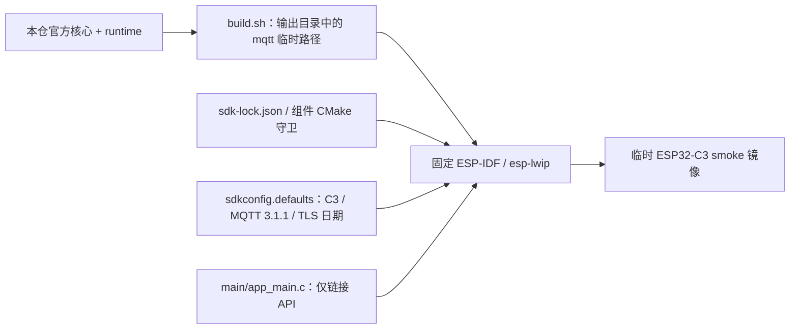

# ESP32-C3 组件编译检验

此工程只编译并链接仓内 `mqtt` 组件和 `emqtt_` API，`app_main` 使用空配置作静态检查，不建立 Wi-Fi、Broker、TLS 会话，不保存 NVS，也不作为可刷写实验固件或正式制品。它只证明当前本地源码、固定 IDF/lwIP 和 C3 编译器能够共同构建。

## 架构拓扑



仓库逻辑名是 `esp-mqtt`，ESP-IDF 本地组件名从目录 basename 取 `mqtt`；`build.sh` 只在显式输出目录创建指向本仓的临时 `mqtt` 路径，实际源码仍只有一份。直接把仓根作为本地 `EXTRA_COMPONENT_DIRS` 会按 `esp-mqtt` 发现组件，不能解析 `main` 要求的 `mqtt`。这条本地构建路径不代替以后从公开 Git 精确提交消费的 Component Manager 验证。

准备[已锁定 SDK](../../tools/README.md)，导出 `IDF_PATH` 后从仓根运行：

```bash
bash tests/c3-smoke/build.sh /private/build/esp-mqtt-c3-smoke
```

输出目录首次必须没有 `mqtt` 入口；默认不传路径时用新的临时目录。脚本不会清理或刷写镜像。`dependencies.lock` 固定本 smoke 工程的 IDF 6.1.0，组件源身份由本仓及 `sdk-lock.json`、CMake 守卫共同核对。可联网、可订阅、可恢复的独立实验应用和实板验收仍待完成。
