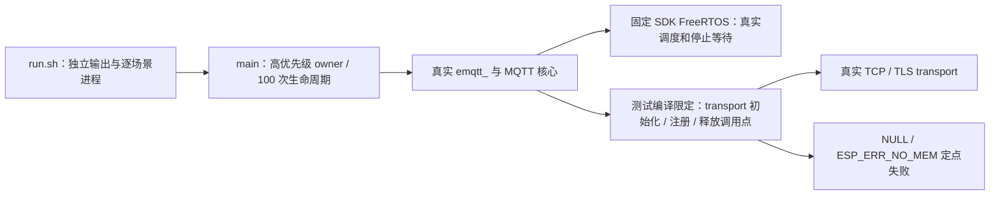

# Linux 真实核心生命周期回归

本工程在 `sdk-lock.json` 固定的 IDF Linux target 编译真实 `mqtt_client.c`、`emqtt_`、FreeRTOS 队列/任务与 SDK transport。它不连接 Broker、不执行 TLS 握手，不读取凭据或操作设备。

## 架构拓扑



导出锁定 SDK 的 `export.sh` 后，从仓根运行：

```bash
bash tests/linux-lifecycle/run.sh "$PWD" /tmp/esp-mqtt-linux-lifecycle
```

每个场景独立进程，超时 20 秒。owner 优先级为 10，高于运行层 MQTT 任务的 5，使立即 `stop` 确定发生在 worker 首次调度前。前五个场景分别检查立即停止、TCP/TLS transport 初始化失败、TCP/TLS transport 注册失败；后四项都要求错误事件、FAILED 状态和完整停止/销毁。注册失败还核对未入列表的实际 transport 被释放。每次停止后在同一实例再次启动并立即停止，确保旧停止通知不能提前结束新任务的等待。

第六个场景直接调用官方 API：高优先级 owner 在等待退出时，第二个 caller 必须返回失败，不能和 owner 同时清理同一任务句柄。

前五个场景各执行 100 次 create/destroy、200 次 start/stop，第六项执行 100 次双 caller 竞争。只对 MQTT 组件的四个 SDK 调用点替换符号，测试宏不进入正式组件构建。回归证明真实任务和 transport 的相关所有权边界；计数器不是全堆泄漏检测，不覆盖 C3 实板、真实 OOM 峰值、TLS 握手或 Broker 业务。
