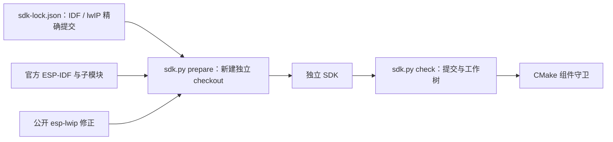

# SDK 准备与检查

`tools/sdk.py` 根据本仓 `sdk-lock.json` 使用公开精确提交准备独立 ESP-IDF checkout，并只将其 lwIP 子模块切到已验证修正提交。`prepare` 仅接受不存在的新路径，不覆盖机器已有 SDK；`check` 核对 IDF、lwIP、子模块状态和唯一预期 gitlink 差异。

## 架构拓扑



```bash
python3 tools/sdk.py prepare --path "$HOME/.espressif/frameworks/esp-mqtt-idf"
bash "$HOME/.espressif/frameworks/esp-mqtt-idf/install.sh" esp32c3
source "$HOME/.espressif/frameworks/esp-mqtt-idf/export.sh"
python3 tools/sdk.py check --path "$IDF_PATH"
python3 -m unittest discover -s tools/tests -p 'test_*.py'
```

准备 SDK 可能下载上游与工具链；本轮仅用已经存在的独立受控 checkout执行 `check`，没有运行 `prepare` 或修改已有 SDK。host 运行层测试不需要 ESP-IDF。硬件构建与刷写属于后续单独验收。
