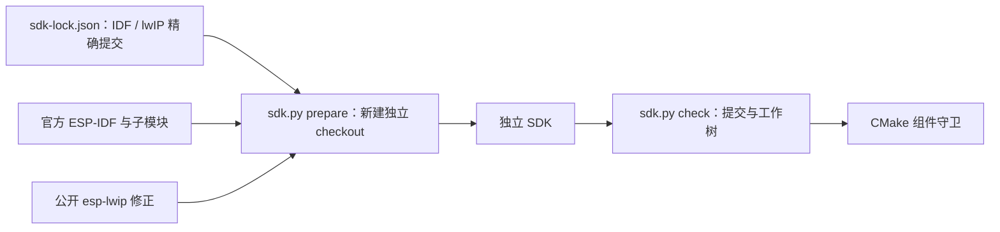

# SDK 准备与检查

`tools/sdk.py` 根据本仓 `sdk-lock.json` 使用受控参考来源的公开精确 master 提交准备独立 ESP-IDF checkout，并只将其 lwIP 子模块切到已验证修正提交。受控 IDF 以原 `esp-space/esp-idf@578cf89c343e388db43ba1f4ddcd602fedcb763c` 为业务基线，只追加 Actions 退出与实际命中的嵌套来源绑定；各受控来源的 `workspace-source.json` 保留原上游和精确 base。`prepare` 仅接受不存在的新路径，不覆盖机器已有 SDK；`prepare` 显式忽略上游子模块的浅克隆建议，完整取得根与递归依赖；`check` 核对 IDF、lwIP、子模块状态和唯一预期 gitlink 差异，并拒绝 shallow/partial/sparse 来源及缺失对象。

## 架构拓扑


```mermaid
flowchart LR
    lock["sdk-lock.json：IDF / lwIP 精确提交"] --> prepare["sdk.py prepare：新建独立 checkout"]
    official["官方 ESP-IDF 与子模块"] --> prepare
    fixed["公开 esp-lwip 修正"] --> prepare
    prepare --> checkout["独立 SDK"]
    checkout --> check["sdk.py check：提交与工作树"]
    check --> component["CMake 组件守卫"]
```

```bash
python3 tools/sdk.py prepare --path "$HOME/.espressif/frameworks/esp-mqtt-idf"
bash "$HOME/.espressif/frameworks/esp-mqtt-idf/install.sh" esp32c3
bash "$HOME/.espressif/frameworks/esp-mqtt-idf/install.sh" esp32
source "$HOME/.espressif/frameworks/esp-mqtt-idf/export.sh"
python3 tools/sdk.py check --path "$IDF_PATH"
python3 -m unittest discover -s tools/tests -p 'test_*.py'
```

准备 SDK 需要网络与足够磁盘空间，普通入口完整下载源码；工具链安装另行执行。SDK 根 Git 元数据必须位于来源自身目录；absorbed submodule 的 gitdir 仅允许位于根来源自有 Git modules 下，并以原生 core.worktree 绑定当前子目录，独立子模块可保留自身 `.git`。来源 gitdir 与 common-dir 必须一致，对象目录与对象不得借用仓外存储；符号链接、无绑定定位文件、外置 separate-git-dir 和 linked worktree 被拒绝。Git 环境不得重定向来源、索引或对象目录，replace/grafts 历史替换一律拒绝，所有 Git 读取显式禁用对象替换。每个递归来源显式检查工作树，不受 `submodule.*.ignore` 配置影响。host 运行层测试不需要 ESP-IDF。硬件构建与刷写属于后续单独验收。

lwIP 锁已选择源码退出 PR 正式合入 `darren-you/esp-lwip` canonical `master` 的完整 SHA `f6e98c34ad65d31419b3fbb1fe27015e46060a6a`；原已验证业务修正 `2758df4cd3666b3b2a5b53830148379326425c0d` 保留为业务基线，该后继未改变 lwIP 运行源码。普通完整 SDK 来源检查不代替固件或 Broker 全链路验收。
