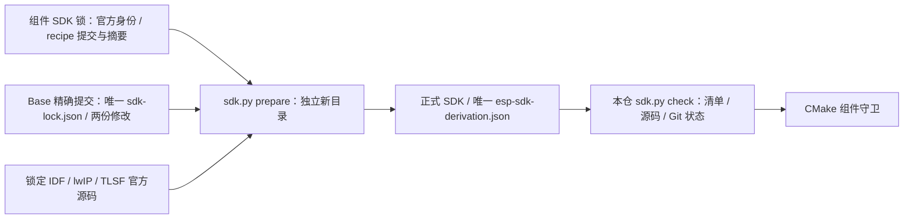

# SDK 准备与检查

`tools/sdk.py` 只消费本仓 [sdk-lock.json](../sdk-lock.json)、Python 标准库、Git 和锁定的公开来源。组件锁保存 IDF／lwIP 身份，以及 ESP Base 唯一 recipe 的来源提交与完整摘要；TLSF、两份修改与逐文件原文／派生摘要只存在于该 recipe。组件不保存第二套 patch 清单或脚本。


```mermaid
flowchart LR
    lock["组件 SDK 锁：官方身份 / recipe 提交与摘要"] --> prepare["sdk.py prepare：独立新目录"]
    recipe["Base 精确提交：唯一 sdk-lock.json / 两份修改"] --> prepare
    sdk["锁定 IDF / lwIP / TLSF 官方源码"] --> prepare
    prepare --> checkout["正式 SDK / 唯一 esp-sdk-derivation.json"]
    checkout --> check["本仓 sdk.py check：清单 / 源码 / Git 状态"]
    check --> component["CMake 组件守卫"]
```

```bash
export PYTHONDONTWRITEBYTECODE=1
python3 tools/sdk.py prepare --path "$HOME/.espressif/frameworks/esp-mqtt-idf"
bash "$HOME/.espressif/frameworks/esp-mqtt-idf/install.sh" esp32c3 esp32
source "$HOME/.espressif/frameworks/esp-mqtt-idf/export.sh"
python3 tools/sdk.py check --path "$IDF_PATH"
python3 -B -m unittest discover -s tools/tests -p test_sdk.py
```

`prepare` 只创建不存在的新路径，从冻结 Base 提交读取 recipe 和两份修改的数据，不执行 Base 构建或 SDK 内脚本。它核对清单与 patch 摘要、所有官方原文及完整修改集合，在全部 `git apply --check` 通过后才应用；最后独占创建 SDK 根普通文件 `esp-sdk-derivation.json`，其字节与冻结 recipe 完全相同。工具链安装与导出仍是独立的官方入口。

`check` 只读本地 SDK：先核该普通文件的完整摘要，再核官方 IDF／lwIP／TLSF 提交、逐文件原文与派生摘要、索引、精确工作树差异及所有子模块；不下载、不执行未知脚本，不调用相邻仓库。未装配旧 SDK、清单缺失／链接／漂移、部分修改、未声明修改及子模块漂移均拒绝。既有路径和失败现场保持，不提供自动修复、可选 allowlist 或旧门回退。`--quiet` 供构建调用，仅省略成功输出。

真实 Git fixture 覆盖独立准备、精确来源与逐文件校验，以及原始 lwIP、脏状态、索引、TLSF、清单、链接、部分修改和越界路径等拒绝；它不下载真实 SDK、不触达设备。软件守卫通过不授予 MQTT／Base 组合容量、Broker 或实板资格。


来源检查使用完整原生 Git 对象、HEAD 原始树、索引，以及实际源码字节、类型、执行位和符号链接目标；逐个递归来源拒绝 shallow／partial／sparse、缺失或被改写对象、借用对象库、外置或无绑定元数据、replace／grafts、Git 来源环境重定向，以及包括 ignored 在内的所有未跟踪内容。absorbed 子模块只接受根来源自身的 Git modules 与原生 core.worktree 绑定；独立子模块保留自身 `.git`。sparse／promisor 按 Git 作用域、include 和原生布尔语义核对最终有效值，完整来源允许有效的 false，partial clone filter 标记仍拒绝。`prepare` 完整取得根与递归精确 gitlink，不使用 shallow 获取；唯一 stamp 为 `0400` 的普通文件，其内容与冻结 recipe 逐字相同。

从 SDK 安装与导出前设置 `PYTHONDONTWRITEBYTECODE=1`，后续 `idf.py`、CMake 和独立 Ninja／`cmake --build` 保留该环境，避免 SDK 来源出现 Python 缓存；来源检查仍拒绝所有 ignored 内容。真实临时 Git 回归同时核对 schema2 派生与这些严格来源边界，不下载真实 SDK，不授予固件、Broker、双板容量或实板资格。

IDF 与 lwIP 的原始唯一 origin 和 Git 实际 fetch 身份必须与配方相同；支持对应 canonical HTTPS／SSH 写法，不改写来源配置。来源检查仅消费原始对象、索引与文件，不运行内容转换的 status／diff 或 Shell 子模块入口；全部 Git 查询显式禁用 fsmonitor。首次新 SDK checkout 前及容量补丁装配前读取全部配置作用域的最终有效 clean／smudge／process 命令，任何非空外部 filter 均在首次 `git apply` 前拒绝，不让外部命令改写已核对的源码。
